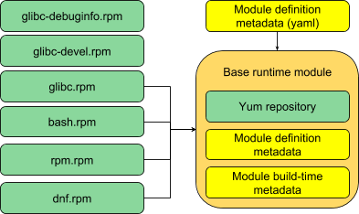

The Module
==========

We group these binary packages into *modules*. Note, we can pick just a
subset of the subpackages from a particular build into a given module,
eg. some hypothetical example base runtime module:

These are internal build groupings: basically *repositories*, but with
additional metadata and semantics that allow them to play nicely with
other modules and module tooling.

We attach metadata to these modules, on top of the normal metadata in a
repository. That can be support metadata (SLAs or EOL dates for the
module); metadata on how to use the module (eg. its dependencies,
default installed packages); identity (builder, vendor, version etc), or
many other things that we’re still just starting to imagine.

We should be able to update the module as a unit: updating and testing
its component parts as necessary, but also testing the module as a whole
before releasing an update.

We refer to the assembly of a module by a build tool as a *compose*.
This step includes no compilation; it is merely the creation of a
bundled set of packages and metadata comprising a single module. The
closest analogue in today’s build system is the “puddle build”, where a
custom repository is created for a particular purpose.

When we talk about a **module compose**, we are *not* talking about “the
Compose” of a full distribution release. The two are similar, in that
they both assemble existing compiled packages into bundled output; but
the module compose is just one single targeted assembly, whereas the
full distribution Compose typically creates multiple repositories and
images as output in a single large job. Also note that we can in theory
perform the build of the packages within a module, and the compose of
the module itself, as a single step; we might term this a **module
build.**
