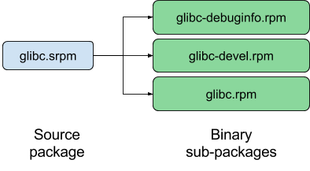

The Package
===========

We can start with the familiar ''package ''and *subpackage*, *built* as
usual from a *component* (or *source package*):

We’re not changing anything at this level (yet… non-rpm packages are a
possible topic for the future!)

It is important to distinguish the build of a package from the compose
of a module; the build here is the step which includes compilation and
creation of a reusable bundle of the compiled output. We might be
building specifically to compile for a module’s contents; but the build
step is still a distinct step.
