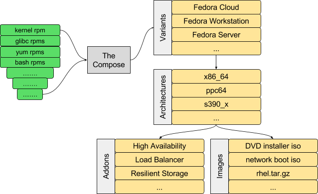

Breaking down the monolithic release
====================================

We have many steps in the release pipeline today: starting with bugzilla
and dist-git; building and tagging in brew; the errata tool and mirrors for
pushing the bits out.

But currently it all comes together in The Compose.

Remember, I’m not talking about branching and versioning in this
particular document. So let’s start with the assumption that we’ve
already built our individual packages, and that (for now) we have a flat
namespace of binary rpms already built from all our components. That
namespace could be living in a yum repository like the rawhide repo, or
a koji tag such as fedora-24.0-candidate.

We build all of the images and repositories, for all of the
architectures and their addons, for all of the variants, all at once.
Fedora’s Editions have a similar structure.

This served us well once upon a time. It enabled a single consistent
major or minor release, and it built everything necessary for that
release.

But it now falls short on multiple fronts:

-  We have many more types of artifacts being built than are handled by
   the compose. We have ostree trees and installer images; there are
   cloud targets such as qcow images and AMIs; and docker base and
   layered images. We have additional, often ad-hoc,
   incompletely-automated builds to create this additional content.
-  The modularity effort is explicitly trying to get away from the
   concept of a single monolithic distribution, and to release modular
   parts of the distribution on independent release cycles.
-  Scaling: as we increase the number of modules, we do not want to
   spend the effort of rebuilding the entire distribution when any small
   part changes. For example, with more container images to build, we
   should be trying to rebuild only those affected by any change.
-  Self-service: to scale the modular decomposition of the distribution,
   we will need the ability for individual engineers or groups who own a
   module or image to build that themselves, not dependent on release
   engineering.
-  Continuous Integration. For automated testing, we want rebuilds to
   happen automatically when a dependency changes, instead of having to
   wait for a compose that happens on a predetermined schedule, or when
   manually triggered by release engineering.

So how can we address some of these concerns? We take the following
steps:

-  Break down the distribution compose into smaller parts:
-  Ensure each part can be composed based on configuration and content
   in SCM. **Everything must be recomposable based on static content**:
   never, ever require manual configuration of a compose. That way
   composes can be automated;
-  Combine the smaller composes up in stages building towards a full
   distribution;
-  Record a compose ID for every stage of the compose, and record which
   compose IDs are used as input to subsequent layered composes
-  Record the most recent successful compose for each module, so that
   failed composes (or composes that fail testing) do not impact layered
   modules
-  Optionally, we can automate the process of chain composes and add CI
   to the mix to achieve a fully automatic build toolchain.
