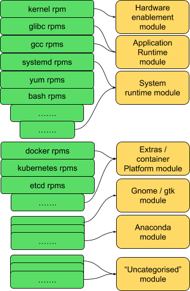
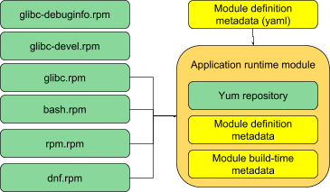
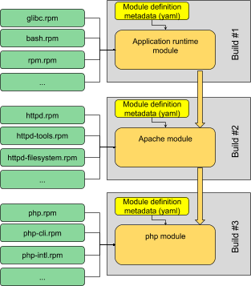
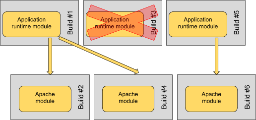

Incremental compose of the distribution
=======================================

**1. Break the distribution into distinct modules**

Let’s take this in stages. We can start by simply assigning individual
packages to modules (at the sub-package level: we may have a need to
have a library in a base module but have its -devel subpackage in a
developer-only module, for example.) This ignores the branching of
packages and modules, but as stated before, that’s a separate topic.

Note: '''The module boundaries here are just examples. '''They are
illustrations to show how we can break the monolithic distribution up.
They are *not* proposals that we should draw the lines between modules
in any particular places: that is an entirely separate discussion.

We can start with some obvious “core” modules such as hardware
enablement, system runtime and core application runtime.

The installer needs GTK and Anaconda; let’s make sure we have homes for
those.

This leaves a lot of content currently not assigned to a module. That’s
fine, we can figure out how to handle those; for example, we could
choose to define a module for “uncategorised” for now, and another for
those packages currently in Optional.

All we have done so far is to draw boundaries around groups of existing
packages:

We can add Apache, php and mariadb, and we could have the components of
a LAMP stack, etc; there are plenty more groups we can imagine here.

Note: This picture shows a static allocation of packages to modules. So,
modules have a **static manifest**. This is deliberate:

If, over time, a package in a module picks up a new dependency, then it
should be a human decision to determine which module that new dependency
should live in (or even whether we want that dependency at all.) This
allows us to combat dependency sprawl over time, and also to record
*why* a particular package lives in a particular module, at the time we
add a dependency.

To enable an engineer to manually allocate new dependencies to modules,
it it necessary that module manifests should not just be automatically
generated. We consider that manifest to be one of the defining
properties of the module.

**2. Automate the composing of modules from packages**

We now want to compose a module. Bear in mind, “composing” the module
here involves assembling pre-existing binaries: it’s more a “createrepo”
than “rpmbuild” (and is similar to a “puddle” build in current RCM
terms.) And the automation we’re talking about here is the execution of
the module compose, even if the compose is actually triggered manually.

A module compose is now simply the creation of a yum repository of the
required packages or subpackages, with the addition of a small amount of
module metadata as described in `Building modular
things <Modularity/Getting_started/Building_modular_things>`__.

We plan the module definition metadata living in dist-git, similarly to
how we currently maintain component spec files, sources definitions and
patches. Regardless of where it lives, **the module compose must be
well-defined based on static content.** The essence of an automated
build system is that when a compose is required, there should be no
compose-time configuration added; everything to compose the module is
stored in SCM and should be completely repeatable from there.

This workflow mirrors existing practice for building binaries, where a
developer expects to be able to build and test an rpm locally for a
single architecture, before submitting to the build system to be built
on multiple architectures. In the same way, we would expect the
build-system module compose tool to pull together the necessary packages
and to create arch-specific modules for each required architecture.

We mentioned before that we expect modules to have a static manifest.
During module compose, however, we would still expect to perform
*repoclosure* on the module: ie. to verify that the module satisfies the
dependency requirements of all packages it includes. Failure of
repoclosure should constitute a failed compose of the module. The
tooling may still attempt to solve missing dependencies automatically,
but should only report to the user which packages could be included to
satisfy those dependencies; it should not include those in the output
without confirmation from the module owner.

To automate module composes it will be vital to know exactly which
version of which packages should be used to compose any given module
(eg. for brew builds, this would be selected by brew tag.) The important
point is that all of this should be configured in the module metadata so
that we can compose the entire module automatically.

**3. Automate the composing of stacks from modules**

Recall that a stack is nothing more than a module that depends on other
modules; the stack simply refers to that whole tree of dependencies.

So composing a stack requires nothing more than composing a module that
has dependencies. We define that top-level module via a metadata file in
dist-git just as for any other module. The required dependent modules
are listed in the module’s defining metadata. This is important: just as
for a compose of an independent module, the entire module compose is
well-defined based on static content.

The only difference in the compose of such a higher-level module is in
the checking of internal rpm dependencies: both the repoclosure test,
and any hinting done to suggest missing packages, should be performed on
*all* packages in the entire stack, including all of the packages from
other modules that this module depends on.

Of course, we may be composing a module multiple times. And to manage
consistency between modules when things are changing, we really need to
be able to determine exactly which version of a module has been composed
from exactly which versions of its dependencies. So '''each module
compose must have a unique compose identifier '''of some form; and
during a layered module compose, we must record the compose IDs of all
the modules used as input for this compose.

So to compose a PHP-on-Apache stack we might simply compose the base
runtime module, then a layered Apache module, and finally a php module
on top, in that order:

**4. Automate the composing of images and other artifacts**

So, now we’ve got enough modules to represent entire stacks of content
suitable for installation to solve some user problem. But still, these
are no more than repositories of available content; we still need to
actually install them to use them.

Sometimes the user will install them themselves; the module client can
automate the complete installation of an entire stack of dependent
modules seamlessly.

But sometimes we’ll want to pre-install the content into some other
artifact: a container image, an installer iso, or an ostree tree, for
subsequent delivery to the user. That’s fine, we can drive whatever
tools we need to build these artifacts. The only principles we rely on
are the ones we’ve already mentioned:

-  We need to compose the images from static configuration/manifests: no
   manual invocation of builds with magic command line parameters, the
   tools should be able to find all the configuration/input they need
   from SCM etc.
-  Record compose IDs of everything we consume as input, and generate a
   build ID from the output;
-  Each compose produces just one artifact (or as few as possible); no
   monolithic composes that try to build massive amounts of the distro
   in a single step. We end up with the same traceability because the
   composes can all use the same exact inputs guaranteeing the artifacts
   are the same except for their distribution packaging.

**5. What happens when a compose fails?**

One problem with a monolithic compose is that a single problem can fail
the entire compose.

How do we prevent a similar situation where a broken compose of a base
runtime module causes compose failures for all other modules depending
on it?

Having a granular compose process actually improves this situation
significantly. We simply need to remember the most recent *successful*
compose for any given module, and use that compose for any subsequent
layered composes.

So composing modules here from left to right still works fine; the
failed compose #3 of our base runtime module does not prevent a
subsequent compose #4 of the Apache module from succeeding; that compose
simply picks up the most recent successful compose of the base runtime.
And when a new compose of the base runtime does eventually succeed, then
it becomes available to future composes of the Apache module on top.

**6. Chaining recomposes**

So far we have talked about “composing” a module in terms of re-running
the creation of that module from its component parts (the packages it
contains, and the metadata belonging to the module) on demand. When a
module compose is requested, the build system must have enough
information to complete that compose on its own, but the build system
does not necessarily know itself *when* to compose a module.

But of course, we can automate that part too. Just as a CI package
workflow might want to rebuild and retest an rpm when a dist-git event
occurs, we want to be able to recompose both modules and artifacts
whenever their content changes.

The details of each individual task here are not important; indeed, it
is important to include many different types of task in this automation.
Recomposing a module may be triggered by an rpm rebuild; that recompose
may trigger other module recomposes, and additionally may trigger other
image rebuilds. We may add CI to the mix so that testing tasks are also
triggered when appropriate.

What *is* important is that the chaining of tasks is automatic. When
something changes in the content tree, the build system '''must '''know
(or be able to tell us) what else needs to be rebuilt or recomposed as a
consequence; it **must** have the information needed to perform those
rebuilds without additional manual configuration; and it **should** have
the ability to trigger those rebuilds automatically subject to rel-eng
policy.

Which leads us to:

**7. The Release Concept**

A CI / chain-build toolchain is fundamentally asynchronous. Content is
rebuilt, recomposed or re-tested when its dependencies change. This is
deliberate: a modular release is, by definition, attempting to break up
the monolithic, synchronous Compose.

But ultimately, engineering still wants to be able to produce a planned
release spanning many modules, and users still want to have controlled,
predictable releases, rather than having modules dribble into a release
in drips. We still have major release events such as Fedora major/minor
updates, and we have been going further in this direction recently for
errata with the advent of consolidated batched updates in Fedora 24
z-stream. Atomic Host updates need a coordinated release of base Fedora
updates plus container enablement from -Extras; and a new release of
Software Collections involves the synchronised release of many
individual stacks.

So decomposing the release into loosely-coupled compose steps is all
well enough, but we need more than just chain rebuilds to bring it all
back together. We need to know what modules need to come together on
what date to make a given release.

So we introduce the formal concept of a **release** as a concept that
defines requirements across multiple modules. The release would define,
for example:

-  Which modules are included in the release (and, if those modules have
   multiple versions available, which versions come together for this
   release);
-  The date scheduled for the release;
-  Minimum SLA and lifecycle expectations for the release, so that we
   can verify during planning that all the required modules and all
   their dependencies have the required support

This information cannot be inferred from the individual modules
comprising a release. The reason is simple: it’s a primary assumption in
modularity that any one module may be included in multiple products
and/or multiple releases.

Furthermore, there is a chicken-and-egg situation involving build-system
automation of modules. If module definitions live in dist-git, then how
does a build system know which dist-git repositories to look up to know
what builds need to be performed automatically? The release is a natural
place to define that.

Note: Technically, a release could easily be encoded as yet another
dist-git module itself, one with many dependencies and no additional
content of its own. It could be similar to an rpm meta-package in this
regard. But it is still a distinct concept.
