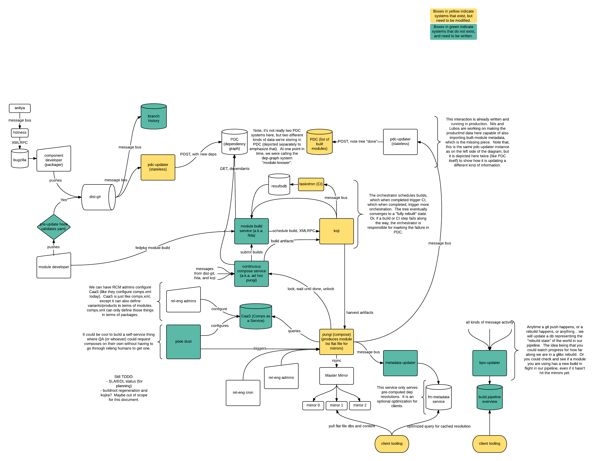

Infrastructure Service Proposal
======

Here is an overview diagram of the set of systems and services that
would be involved in maintaining, building, and shipping a module.

Let’s go through each piece.

+-----------------------------------+--------------------------------------------------------------------------------------------------------------------------------------------------------------------------------------------------------------------------------------------------------------------------------------------------------------------------------------------------------------------------------------------------------------------------------------------------------------------------------------------------------------------------------------------------------------------------------------------------------------------------------------------------------------------------------------------------------------------------------------------------------------------------------------------------------------------------------------------------------------------------------------------------------------------------------------------------------------------------------------------------------------------------------------------------------------------------------------------------------------------------------------------------------------------------------------------------------------------------------------------------------------------------------------------------------------------------------------------------------------------------------------------------------------------------------------------------------------------------------------------------------------------------------------------------------------------------------+
| **Dist-git**                      | We’ll be keeping the definitions of modules in dist-git, using the namespace approach that we already have implemented in pkgdb and dist-git in Fedora Infrastructure.                                                                                                                                                                                                                                                                                                                                                                                                                                                                                                                                                                                                                                                                                                                                                                                                                                                                                                                                                                                                                                                                                                                                                                                                                                                                                                                                                                                                         |
+-----------------------------------+--------------------------------------------------------------------------------------------------------------------------------------------------------------------------------------------------------------------------------------------------------------------------------------------------------------------------------------------------------------------------------------------------------------------------------------------------------------------------------------------------------------------------------------------------------------------------------------------------------------------------------------------------------------------------------------------------------------------------------------------------------------------------------------------------------------------------------------------------------------------------------------------------------------------------------------------------------------------------------------------------------------------------------------------------------------------------------------------------------------------------------------------------------------------------------------------------------------------------------------------------------------------------------------------------------------------------------------------------------------------------------------------------------------------------------------------------------------------------------------------------------------------------------------------------------------------------------+
| **Branch history**                | In the event that we decide on version-pinning approach #2, we’re going to need a way to remember what branch refs pointed to which git hashes and what point in time. This is so that, when a patch is applied to a supported branch for a component, we can determine what modules have been built against the old hash and then rebuild them. As noted in the diagram, it may be that we can extract this information from the git history itself - nonetheless, it will be useful to have a queryable network service that exposes that information to other services.                                                                                                                                                                                                                                                                                                                                                                                                                                                                                                                                                                                                                                                                                                                                                                                                                                                                                                                                                                                                     |
+-----------------------------------+--------------------------------------------------------------------------------------------------------------------------------------------------------------------------------------------------------------------------------------------------------------------------------------------------------------------------------------------------------------------------------------------------------------------------------------------------------------------------------------------------------------------------------------------------------------------------------------------------------------------------------------------------------------------------------------------------------------------------------------------------------------------------------------------------------------------------------------------------------------------------------------------------------------------------------------------------------------------------------------------------------------------------------------------------------------------------------------------------------------------------------------------------------------------------------------------------------------------------------------------------------------------------------------------------------------------------------------------------------------------------------------------------------------------------------------------------------------------------------------------------------------------------------------------------------------------------------+
| **pdc-updater**                   | In Fedora Infrastructure, we currently have a service running that listens to our message bus. When it notices that pungi has completed a new compose, it uploads the metadata about that compose to PDC. In our diagram here we have two depictions of pdc-updater where it needs to be modified to handle two new types of data to be included in PDC. On the left hand side, we want to listen for dist-git changes for modules which have added or removed a dependency. We want to push that dependency to the release-component-relationships endpoint in PDC, which we’ll then query later to find out “what depends on what”. There’s a `taiga card <http://taiga.fedorainfracloud.org/project/modularity/us/350>`__ for this requiring changes to `pdc-updater <https://github.com/fedora-infra/pdc-updater>`__. Eventually we'll want to store and query other metadata, so we can e.g. query what components are part of a module, which modules contain a component, too. On the right hand side of the diagram, we want to continue to listen for new pungi composes as we do now, but we want to additionally import information about *built modules included in that compose*. These are modules that we are preparing to ship.                                                                                                                                                                                                                                                                                                                                |
+-----------------------------------+--------------------------------------------------------------------------------------------------------------------------------------------------------------------------------------------------------------------------------------------------------------------------------------------------------------------------------------------------------------------------------------------------------------------------------------------------------------------------------------------------------------------------------------------------------------------------------------------------------------------------------------------------------------------------------------------------------------------------------------------------------------------------------------------------------------------------------------------------------------------------------------------------------------------------------------------------------------------------------------------------------------------------------------------------------------------------------------------------------------------------------------------------------------------------------------------------------------------------------------------------------------------------------------------------------------------------------------------------------------------------------------------------------------------------------------------------------------------------------------------------------------------------------------------------------------------------------+
| **Orchestrator (ad hoc pungi)**   | We’re reluctant to build a workflow engine directly into koji itself. It makes more sense to relegate koji to *building and storing metadata about artifacts* and to instead devise a separate service dedicated to scheduling and orchestrating those builds. It will make heavy use of PDC (and perhaps the branch-history service) to know **what** needs to be rebuilt. When a component changes, the orchestrator will be responsible for asking what depends on that component, and then scheduling rebuilds of those modules directly. Once those module rebuilds have completed and have been validated by CI, the orchestrator will be triggered again to schedule rebuilds of a subsequent tier of dependencies. This cycle will repeat until the tree of dependencies is fully rebuilt. In the event that a rebuild fails, or if CI validation fails, maintainers will be notified in the usual ways (the Fedora notification service). A module maintainer could then respond by manually fixing their module and scheduling another module build, at which point the trio of systems would pick up where they left off and would complete the rebuild of subsequent tiers (stacks).                                                                                                                                                                                                                                                                                                                                                                               |
+-----------------------------------+--------------------------------------------------------------------------------------------------------------------------------------------------------------------------------------------------------------------------------------------------------------------------------------------------------------------------------------------------------------------------------------------------------------------------------------------------------------------------------------------------------------------------------------------------------------------------------------------------------------------------------------------------------------------------------------------------------------------------------------------------------------------------------------------------------------------------------------------------------------------------------------------------------------------------------------------------------------------------------------------------------------------------------------------------------------------------------------------------------------------------------------------------------------------------------------------------------------------------------------------------------------------------------------------------------------------------------------------------------------------------------------------------------------------------------------------------------------------------------------------------------------------------------------------------------------------------------+
| **Taskotron (CI)**                | Taskotron itself will likely need only minor patching, to be aware of modules as an entity that can be tested. There will be much more involved work required of the Modularity Working Group to propose and implement some default tests for all modules, as well as some guidelines for writing tests specific to individual modules.                                                                                                                                                                                                                                                                                                                                                                                                                                                                                                                                                                                                                                                                                                                                                                                                                                                                                                                                                                                                                                                                                                                                                                                                                                        |
+-----------------------------------+--------------------------------------------------------------------------------------------------------------------------------------------------------------------------------------------------------------------------------------------------------------------------------------------------------------------------------------------------------------------------------------------------------------------------------------------------------------------------------------------------------------------------------------------------------------------------------------------------------------------------------------------------------------------------------------------------------------------------------------------------------------------------------------------------------------------------------------------------------------------------------------------------------------------------------------------------------------------------------------------------------------------------------------------------------------------------------------------------------------------------------------------------------------------------------------------------------------------------------------------------------------------------------------------------------------------------------------------------------------------------------------------------------------------------------------------------------------------------------------------------------------------------------------------------------------------------------+
| **Koji**                          | As mentioned earlier, Petr Sabata and Lubos Kocman are working on the details here, but here are some highlights: A module defines its own buildroot, which doesn’t inherit from other buildroots. Accordingly, rebuilding a module will entail building its components from source (or from srpm). We’ll be looking for optimizations, so that we can avoid rebuilding binary rpms if the buildroot of a pre-built rpm matches bit-for-bit.                                                                                                                                                                                                                                                                                                                                                                                                                                                                                                                                                                                                                                                                                                                                                                                                                                                                                                                                                                                                                                                                                                                                   |
+-----------------------------------+--------------------------------------------------------------------------------------------------------------------------------------------------------------------------------------------------------------------------------------------------------------------------------------------------------------------------------------------------------------------------------------------------------------------------------------------------------------------------------------------------------------------------------------------------------------------------------------------------------------------------------------------------------------------------------------------------------------------------------------------------------------------------------------------------------------------------------------------------------------------------------------------------------------------------------------------------------------------------------------------------------------------------------------------------------------------------------------------------------------------------------------------------------------------------------------------------------------------------------------------------------------------------------------------------------------------------------------------------------------------------------------------------------------------------------------------------------------------------------------------------------------------------------------------------------------------------------+
| **Pungi**                         | Pungi currently works by (at the request of cron or a releng admin) scheduling a number of tasks in koji. Deps are resolved, repos are created, and images (live, install, vagrant, etc..) are created out of those repos. This takes a number of hours to complete and when done, the resulting artifacts are assembled in a directory called The Compose. That compose is then noted in PDC. Some CI and manual QA work is done to validate the compose for final releases, and it is rsynced to the mirrors for distribution. With the introduction of modules, we’ll have an explosion in the amount of time taken to build all of the repos for all of those combinations which is why we’re going to break out a good deal of that work into the orchestrator, which would would like to pre-build the parts the constitute a compose, **before we ask for them**. Pungi’s job then, primarily, is reduced to harvesting those pre-built artifacts. In the event that those artifacts are not available in koji, pungi will of course have to schedule new builds for them before proceeding. We have a (good) requirement to allow developers to run pungi in a local environment, disconnected from our infrastructure. This will be hard, but worth it. The gist will be to have pungi contain libs that know *how* to build the artifacts. In production, pungi will schedule a koji task, which in turn makes a builder *call* that koji lib to do the work. In an offline development environment, we’ll configure pungi to just call that lib itself, directly.   |
+-----------------------------------+--------------------------------------------------------------------------------------------------------------------------------------------------------------------------------------------------------------------------------------------------------------------------------------------------------------------------------------------------------------------------------------------------------------------------------------------------------------------------------------------------------------------------------------------------------------------------------------------------------------------------------------------------------------------------------------------------------------------------------------------------------------------------------------------------------------------------------------------------------------------------------------------------------------------------------------------------------------------------------------------------------------------------------------------------------------------------------------------------------------------------------------------------------------------------------------------------------------------------------------------------------------------------------------------------------------------------------------------------------------------------------------------------------------------------------------------------------------------------------------------------------------------------------------------------------------------------------+
| **Comps-As-A-Service**            | More information for you on how pungi currently builds a compose: pungi takes as its input a pungi config file which, while it defines many aspects of the compose, it primarily defines the set of outputs: the artifacts. It furthermore takes in a *variants.xml* file which defines the variants to be produced, in terms of comps groups. Those comps groups are then defined in another comps.xml file. They are just groups of packages -- *our variants are currently defined in terms of groups of packages from the flat Fedora package namespace*. At minimum, we’ll need to modify pungi to accept a definition of the variants in terms of modules, but additionally, we have problems with trying to maintain and copy the comps.xml file all around our infrastructure to build things. We’d like to replace that with *CaaS: Comps-as-a-service*, so we can query for this stuff over the network and manage it (hopefully) more sanely. The big work item here is defining the variants in terms of modules. We’ll still need to produce a comps.xml file to mash into the repo metadata, but we will *generate* that file on the fly from CaaS data.                                                                                                                                                                                                                                                                                                                                                                                                         |
+-----------------------------------+--------------------------------------------------------------------------------------------------------------------------------------------------------------------------------------------------------------------------------------------------------------------------------------------------------------------------------------------------------------------------------------------------------------------------------------------------------------------------------------------------------------------------------------------------------------------------------------------------------------------------------------------------------------------------------------------------------------------------------------------------------------------------------------------------------------------------------------------------------------------------------------------------------------------------------------------------------------------------------------------------------------------------------------------------------------------------------------------------------------------------------------------------------------------------------------------------------------------------------------------------------------------------------------------------------------------------------------------------------------------------------------------------------------------------------------------------------------------------------------------------------------------------------------------------------------------------------+
| **Metadata Service**              | This is an optional client-facing service which can provide cached pre-computed resolutions of dependencies. We don’t have anything like this currently for RPMs. It could be nice to have a generic system which can serve fast dep resolutions for all kinds of artifacts. It is optional, because we expect that we can build the client tools to work just fine with the metadata lists distributed over the mirrors (or CDN). If we find we have UX issues with long waits for dep resolution, we could invest work in a system like this to supplement.                                                                                                                                                                                                                                                                                                                                                                                                                                                                                                                                                                                                                                                                                                                                                                                                                                                                                                                                                                                                                  |
+-----------------------------------+--------------------------------------------------------------------------------------------------------------------------------------------------------------------------------------------------------------------------------------------------------------------------------------------------------------------------------------------------------------------------------------------------------------------------------------------------------------------------------------------------------------------------------------------------------------------------------------------------------------------------------------------------------------------------------------------------------------------------------------------------------------------------------------------------------------------------------------------------------------------------------------------------------------------------------------------------------------------------------------------------------------------------------------------------------------------------------------------------------------------------------------------------------------------------------------------------------------------------------------------------------------------------------------------------------------------------------------------------------------------------------------------------------------------------------------------------------------------------------------------------------------------------------------------------------------------------------+
| **Build Pipeline Overview**       | Another optional client-facing service. It could be nice to be able to query and ask “I have module X installed. Do you have a fresh build of X underway? Is it complete, but not yet available on the mirrors?” This is moreso targeted for developers - it would be nice to be able to query and find the status of any kind of component, module, or image in the pipeline through a homogenous interface.                                                                                                                                                                                                                                                                                                                                                                                                                                                                                                                                                                                                                                                                                                                                                                                                                                                                                                                                                                                                                                                                                                                                                                  |
+-----------------------------------+--------------------------------------------------------------------------------------------------------------------------------------------------------------------------------------------------------------------------------------------------------------------------------------------------------------------------------------------------------------------------------------------------------------------------------------------------------------------------------------------------------------------------------------------------------------------------------------------------------------------------------------------------------------------------------------------------------------------------------------------------------------------------------------------------------------------------------------------------------------------------------------------------------------------------------------------------------------------------------------------------------------------------------------------------------------------------------------------------------------------------------------------------------------------------------------------------------------------------------------------------------------------------------------------------------------------------------------------------------------------------------------------------------------------------------------------------------------------------------------------------------------------------------------------------------------------------------+
