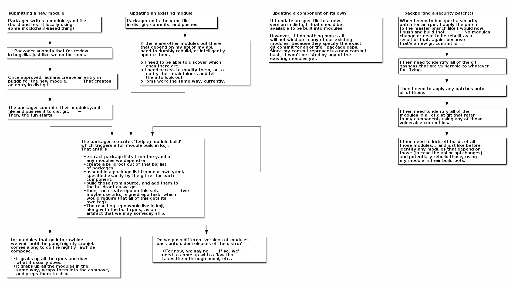

Life of a Module Update
======

Here’s our depiction of some scenarios for module maintainers, without
any automation in place. Take a look at the four starting points,
organized into columns, at the top:

**Submitting a new module**: This is straightforward. There’s no need to
invent a new submission framework here. We’ll reuse the existing
bugzilla->pkgdb->dist-git workflow we have for packages. It will provide
well-known gate point where we can deny new modules that are unfit for
Fedora (criteria to be determined) would create unsustainable burden
(criteria to be determined) or are problematic in some other way.

**Updating an existing module**: The flow here is also similar to
existing packaging workflows. A maintain can update their module’s
metadata definition, commit and push it to dist-git, and then kick off a
“module build” in koji (the details for a koji “module build” here are
non-trivial, and are being lead by Petr Sabata and Lubos Kocman).

**Updating a component**: This is what packagers do today when they
update their package to a new release in rawhide. We may carry modules
that include that package, but they *pin* their dependency to a
*specific version* of that component. Since this is a new version of
that component, we do not have to automatically worry about updating any
modules that depend on this component.

**Backporting a security fix**: This gets tricky. There are currently
(at least) two different competing approaches for *how a module should
pin its dependencies*:

#. Modules should specify their dependency versions by the *git hash of
   a commit in the dist-git repo of that component*.
#. Modules should specify their dependency versions by a *git branch or
   tag on the dist-git repo of that component*.

Note that the author of this document favors approach #2 and that the
workflow diagram above depicts the steps required of module maintainers
for approach #1.

There are problems with each of these and full discussion of those is
outside the scope of this document. Stephen Tweedie will be taking up
the question of versioning and releases in a different document.

In either case, the backporting of a security patch to older versions is
a situation that requires lots of manual work. Patches need to be
applied to the component’s old (either) commits or branches. Dependant
modules either need to have their pinned git hashes updated in their own
dist-git repos (or have their pinned git branch names left unmodified).
Finally, rebuilds need to be scheduled for the entire tree of dependant
modules.

Whichever approach we decide on for pinning component versions, the
exercise above in figuring out “what a module maintainer needs to do”
has been instructive.
