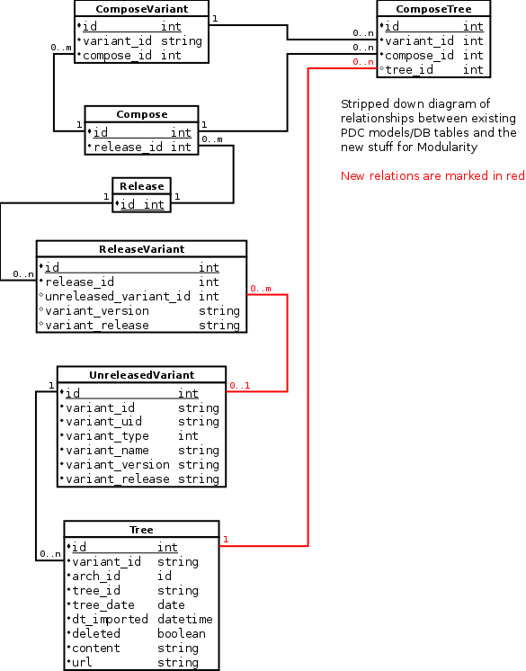

Database structures
==================================

PDC already stores data about products, releases and related
information, but for modules we need to record additional things.

This page is about these changes, and how they should fit together with
the existing structures.

Models
------

The main new models are ``UnreleasedVariant`` which is where we store
modules (but other stuff may use this, too, in the future, so it's a
generic term) and ``Tree`` which carries each tree created for one such
module. This is so we can store e.g. RPM packages for a module which
isn't yet tied to a release, because we may not know that at the time we
build the module. There are peripheral models, e.g. for storing
inter-module dependencies, but they aren't fleshed out yet, so not
described here.

Diagram
-------

This abridged ER diagram outlines the changes we plan to do in terms of
what's stored in the database. Everything upwards from and including
``ReleaseVariant`` are existing tables, everything below is new for
Modularity. New relations are from the ``UnreleasedVariant`` to
``ReleaseVariant`` and from ``Tree`` to ``ComposeTree``.

See Also
--------

-  `Modularity/Architecture/Infra <Modularity/Architecture/Infra>`__

Category:Modularity
