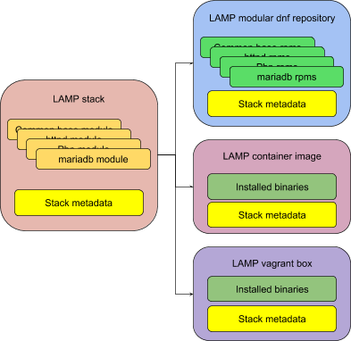

The Image or Artifact
=====================

We build stacks into *images* or other *artifacts* such as ostree trees.
These are the formats in which we release a stack.

For example, we could take a single stack such as a LAMP stack, and
build and release it both as SCL rpms in a yum repository, and as
container images: indeed, we do so today. It’s the same stack in each
artifact. We could add more such formats: virtual appliances, vagrant
boxes, anaconda isos or ostree trees, and it would still be the same
stack in each; only the artifact / format / image has changed.

The format of the content we deliver may be different in each case, but
it’s the same binaries from the same stack inside, and the same stack
metadata describing that content.
