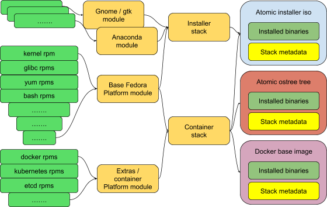

How do these parts fit together?
================================

Let’s look at a couple of examples to make it (hopefully!) clear what
we’re talking about.

Example 1: Our Atomic Host stack
~~~~~~~~~~~~~~~~~~~~~~~~~~~~~~~~

We already release content that is organised in much this way, just not
with any formal definition of modules or stacks.

Atomic, for example, is composed from multiple sources. Some content
comes from traditional Fedora with its usual 6-month lifecycle; and some
comes from other repos with much shorter lifecycle and rapid rebasing to
pick up new features.

And even within Fedora we have different levels of lifecycle. An obvious
example is Gnome; the Anaconda installer stack that we use for Atomic
installer ISO images depends on this faster-moving content, even when
the installed atomic host does not include it.

But even though these distinct sets of components all have differing
lifecycles, they still belong within Fedora and we still produce
coherent output images or artifacts from them today, with planned
releases that require alignment between all the relevant parts. In the
language of this document, it might look like this:

