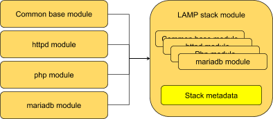
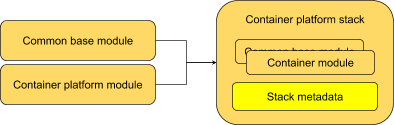

The Stack
=========

We can then combine modules into *stacks*.

A stack should represent something distinct that the user wants. It may
be a traditional developer stack (LAMP, ruby-on-rails, etc.); or it may
be an application (but extended to include all the dependencies that
the application needs to run); or it could be the set of modules needed
to deliver something like Atomic Host or Cockpit.

The stack represents this full set of software. It doesn’t presume how
we distribute it, we’re still just talking about the set of modules
making up the stack.

**A stack is still just a module here.** It’s just a way of referring to
the module plus all its implied dependencies as a single unit, to
distinguish that from the individual modules within the stack; the stack
content and metadata may have exactly the same format as module metadata
(the metadata is the same colour here for a reason!) But it’s still
important (at least internally, probably not for end users) to make the
distinction between a single module, and a module plus all the external
dependencies it relies on.

Importantly, we can take two modules with different lifecycles and
combine them in a single stack. The definition of the stack gives us the
way to plan and track the relationship or dependency between the
modules.

