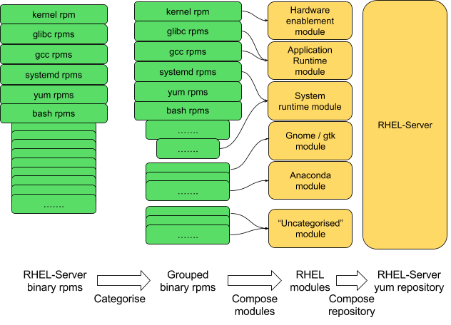
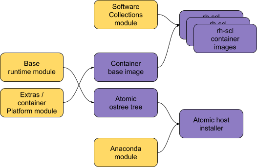

Putting it all back together
============================

We need the flexibility of a smaller, more modular distribution that can
be reassembled in various different fashions. But we also need to be
able to reproduce our current product lineup, or something very similar,
in order not to disrupt our existing install base:

Example: Reproducing the traditional distribution versions
~~~~~~~~~~~~~~~~~~~~~~~~~~~~~~~~~~~~~~~~~~~~~~~~~~~~~~~~~~

Having categorised the Fedora rpms into groups and composed those
package groups into distinct modules, creating what we have
traditionally called a distribution variant or edition can now be done simply
by creating a flat yum repository containing all the desired modules for that
offering. In the terminology we are using here, the output repository is
simply another output artifact.

And of course we can repeat this for different Fedora editions. Having
separate GTK and Gnome modules would allow us to include those modules
when composing the Fedora Workstation repository, but omit those from
the Cloud Edition if we chose. It would also give us a natural way
to reflect that Gnome may rebase at a different cadence from the Base
Runtime.

So today’s editions can simply become different ways of selecting from
the available modules.

The installer iso can also be composed from the various modules here, as
a separate output artifact. The main difference from the traditional
monolithic Compose is that the repositories, images etc. that are
composed today are still composed, but each is created as a logically
separate build.

Add-ons are not drawn above. An add-on is almost completely synonymous
with a module here, and the modules composed as above can naturally
reflect the composition of add-ons.

Example: Creating atomic host/container images
~~~~~~~~~~~~~~~~~~~~~~~~~~~~~~~~~~~~~~~~~~~~~~

A key point of a broken-down, asynchronous build toolchain is that we
can create composes from different modules with different SLAs or
lifecycles, and can combine both modules and existing artifacts into yet
further artifacts.

For example, we can define a tree of required artifact builds for Atomic
Host and our Docker container images (each purple box here represents a
distinct artifact created by a distinct compose task):

The Fedora Server and COPR repos today already have distinct
SLAs and lifecycles. We could build atomic host trees out of both of
those sources, and this can be done easily as a compose step based on
the Base Runtime and Container Runtime modules in a modular build of
the same components.

But we also need to support layered builds, such as additional container
images layered on top of the base image, or Anaconda installs of an
existing ostree tree. As long as we can track which compose steps are
used as input to each compose task, we can track the relationship
between these output artifacts even when we have decomposed the
monolithic Compose into many parts.
