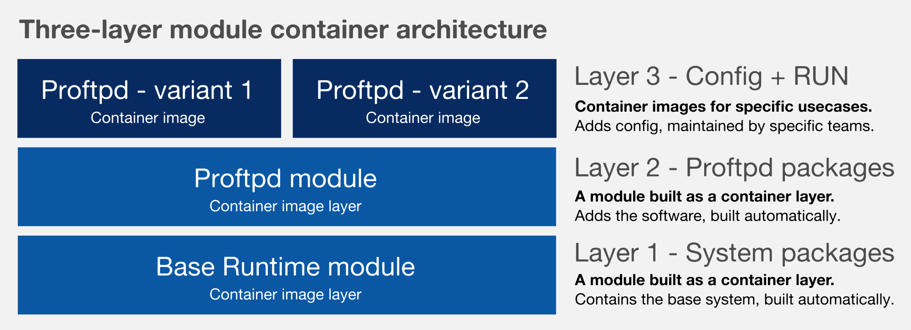

Developing and Building Modules
===============================

This document describes the process of developing and building modules
for the Fedora Modularity project using the `**Module Build
Service** <https://pagure.io/fm-orchestrator>`__ running on your laptop.
I will use my `**proftpd
module** <https://github.com/asamalik/fake-proftpd-module-image>`__ as
an example.

We'll start with writing a `**modulemd** <https://pagure.io/modulemd>`__
file describing the module and its components, and finish by building
one or more containers out of our module.

Architecture
------------

The final result of this guide is a container using a three-layer module
container architecture which clearly separates the system base image
(built out of a Base Runtime), the module itself (the one we are going
to build), and the final configuration.

Examples for each layer: `**Layer
1** <https://github.com/asamalik/fake-gen-core-module-image>`__ \|
`**Layer 2** <https://github.com/asamalik/fake-proftpd-module-image>`__
\| `**Layer 3** <https://github.com/container-images/proftpd>`__

Building
--------

The following guide is rather comprehensive than descriptive. It is
driven by examples linked from this document, but hosted elsewhere.
These examples should be easy enough to help you with building your own
modular container.

Setting up the environment
~~~~~~~~~~~~~~~~~~~~~~~~~~

The easiest way is to use my `**Module
Builder** <https://github.com/asamalik/build-module>`__.

The only two things you need are:

#. Docker running on your system
#. The
   "`**build\_module** <https://github.com/asamalik/build-module/blob/master/build_module>`__"
   script from the `**Module
   Builder** <https://github.com/asamalik/build-module>`__ repository.

Developing and building the module
~~~~~~~~~~~~~~~~~~~~~~~~~~~~~~~~~~

The first thing you need to do is to write a modulemd file describing
your module. Your module needs to include all RPM dependencies for the
thing you are modularizing - except those which are provided by the Base
Runtime. Please see the list of Base Runtime binary packages.

An `**example modulemd for my proftpd
module** <https://github.com/asamalik/fake-proftpd-module-image/blob/master/proftpd.yaml>`__
can help you with writing your own modulemd file.

How to get the list of all the dependencies?
^^^^^^^^^^^^^^^^^^^^^^^^^^^^^^^^^^^^^^^^^^^^

Well, nowadays, you can cheat and run a repoquery (command below) on the
packages you want to use (proftpd in my case) in Fedora 25 and get the
list of your dependencies this way. Then you just leave out all the
packages which are already `**provided by the Base
Runtime** <https://github.com/asamalik/fake-gen-core-module-image/blob/master/packages/gen-core-binary-pkgs.txt>`__.

Getting recursive dependencies of your package: $ repoquery --requires
--recursive --resolve PACKAGE\_NAME

Again, an example can help you understand:

-  `**All Base Runtime
   packages** <https://github.com/asamalik/fake-proftpd-module-image/blob/master/packages/gen-core-binary-pkgs.txt>`__
-  `**All proftpd
   dependencies** <https://github.com/asamalik/fake-proftpd-module-image/blob/master/packages/proftpd-recursive-dependency-binary-pkgs.txt>`__
-  `**Proftpd dependencies not provided by the Base
   Runtime** <https://github.com/asamalik/fake-proftpd-module-image/blob/master/packages/diff.txt>`__

However, in the modular world, there will be no place you can run
repoquery against. So the Modularity team needs to come up with a
tooling that makes this process as easy as possible.

Building the module
^^^^^^^^^^^^^^^^^^^

When you think you have your modulemd ready, you need to place it in a
local git repository. The names of both the repository and the modulemd
must match the module name.

Example: If your module is called proftpd, the repo directory will also
be named proftpd and the modulemd file proftpd.yaml.

Then you simply build it using the
`**build\_module** <https://github.com/asamalik/build-module/blob/master/build_module>`__
script:

``$ ./build_module /module/git/repo /results/directory``

The result will be an RPM repository containing all the packages from
your module.

Containers
~~~~~~~~~~

When you have your module built, let's put it in a container, so we can
use it.

Building Layer 2
^^^^^^^^^^^^^^^^

First, upload your RPM repository from the previous step somewhere
publicly accessible. I've used my `**Fedorapeople to host my modular
packages** <https://asamalik.fedorapeople.org/proftpd-module-repo/>`__.

Next step will be writing a Dockerfile to build a container image with
your module. This container will be representing the Layer 2 in the
three-layer architecture.

Since there is no official Base Runtime image, I have created `**my own
Fake Base
Runtime** <https://github.com/asamalik/fake-gen-core-module-image>`__
that you can use as your base image by specifying
"``FROM asamalik/fake-gen-core-module``".

You also need to write a repo file for your module - see the example
below - and add it to your container, so you can install the module in
it.

Basically, you need to prepare a repository similar to this example:

-  `**The whole Layer 2
   repository** <https://github.com/asamalik/fake-proftpd-module-image>`__

   -  `**Dockerfile** <https://github.com/asamalik/fake-proftpd-module-image/blob/master/Dockerfile>`__
   -  `**repo
      file** <https://github.com/asamalik/fake-proftpd-module-image/blob/master/files/proftpd-module.repo>`__

When you have your Layer 2 repository ready, use "``docker build .``" to
build the container image and "``docker tag username/imagename``" so you
(and maybe other people) can use it as a base for the final layer.

Building Layer 3
^^^^^^^^^^^^^^^^

The final layer will not install anything, it will just add
configuration and the RUN statement to make the image work. You need to
use your Layer 2 image as a base for this one.

An `**example for the proftpd
container** <https://github.com/container-images/proftpd>`__.

And again, when you have your Dockerfile ready, use "``docker build .``"
to build the container image.
